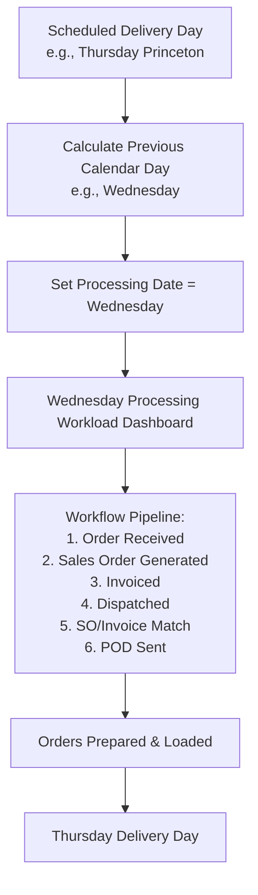

# J&T Supplies CRM — Delivery & Previous-Day Order Processing Schedule Specification

## Overview

In J&T Supplies CRM, **Orders are received and processed on the CALENDAR DAY BEFORE the scheduled delivery date**.

The delivery schedule determines WHICH customers and routes are serviced on a given day, but the operational order processing workload occurs on the **BUSINESS DAY BEFORE DELIVERY**.

---

## Architecture & Core Business Rules

### 1. Delivery Day vs. Order Processing Day Mappings

| Scheduled Delivery Day | Order Processing Day (Previous Calendar Day) | Primary Routes / Cities Serviced |
| :--- | :--- | :--- |
| **Monday** | **Sunday** | Kelowna |
| **Tuesday** | **Monday** | Kelowna, West Kelowna, Summerland |
| **Wednesday** | **Tuesday** | Kelowna, Penticton, West Kelowna, Osoyoos, Oliver |
| **Thursday** | **Wednesday** | Kelowna, Penticton, Princeton, Keremeos, Osoyoos, Oliver, Merritt |
| **Friday** | **Thursday** | Vernon, Salmon Arm, Lake Country, Armstrong |
| **Saturday** | **Friday** | Vernon, Kamloops, Falkland, Chase, Salmon Arm, Lake Country |
| **Sunday** | **Saturday** | Kelowna, Penticton, Osoyoos, Oliver, West Kelowna |

---

## Timezone & Locale Configuration

- **Business Timezone**: `America/Vancouver` (Pacific Standard / Pacific Daylight Time)
- **Locale**: `en-CA` (Canadian English)
- **Default Currency**: `CAD` (Canadian Dollar, `$`)

All date calculations, today/tomorrow determinations, midnight rollover boundaries, and timestamps are explicitly performed using the `America/Vancouver` timezone. Browser timezones and direct unadjusted UTC dates are strictly avoided for business-day calculations.

---

## Order Status Workflow Steps

The complete 6-stage daily operations workflow executed during the **Processing Date**:

1. **Order Received**: Customer order intake recorded.
2. **Sales Order Generated**: Internal Sales Order created in the system.
3. **Invoiced**: Official tax invoice generated and paired with the order.
4. **Dispatched**: Goods staged and dispatched for transit.
5. **SO / Invoice Match**: Verification that Sales Order and Invoice details match (`SAME` / `DIFFERENT`).
6. **POD Sent**: Proof of Delivery documented and dispatched to customer.

---

## Data Schema & Storage

- **`daily_order_operations`**:
  - `operation_date` (ISO date `YYYY-MM-DD`): Processing Date (e.g., `2026-08-19`)
  - `delivery_date` (ISO date `YYYY-MM-DD`): Scheduled Delivery Date (e.g., `2026-08-20`)
  - `route`: Route or city name (e.g., `Princeton`)

Existing historical records retain their original dates for audit trailing, while new records calculate both dates automatically.
